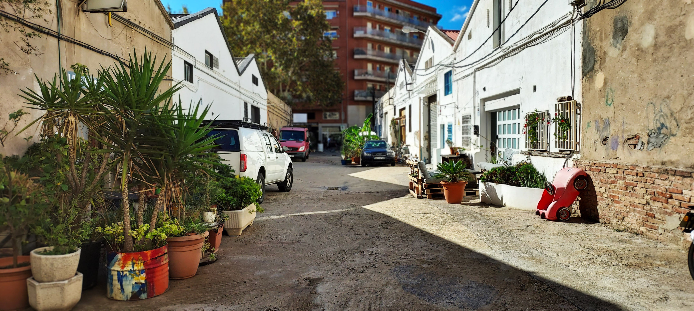

# Contact Us

* You can send us an email at [info@made-bcn.org](mailto:info@made-bcn.org)  
* You can send us a letter at [**Carrer d'Espronceda, 326, nave 11, Sant Andreu, 08027 Barcelona**](https://maps.app.goo.gl/ufcbdXgnTGSDrEVo9)

## Social Media

* Follow our Instagram [@made\_maker\_bcn](https://www.instagram.com/made_maker_bcn)   
* Join our public [Telegram group](https://t.me/+ZfAwT8CPnr8wMmE0)  
* Check out our [Facebook page](https://www.facebook.com/made.bcn)  
* Add our [Google Calendar](https://calendar.google.com/calendar/embed?src=6l9ppc6fipscpnlmpin810ktko%40group.calendar.google.com&ctz=Europe/Madrid) to your personal one

## Visit Us

### Open Days

We try to regularly organise Open Days where anyone is welcome to visit the space (for free) to see our space, ask questions, meet the members, make a donation, become a member, or just to and feed your curiosity\! Please see the Google Calendar for our upcoming Open Days and come along with friends.

### Schedule a Visit

If you wish to schedule a visit for a specific day you can either join our public Telegram group or send an email to [info@made-bcn.org](mailto:info@made-bcn.org) with the subject line: "I wish to visit on \[date|time\]"

