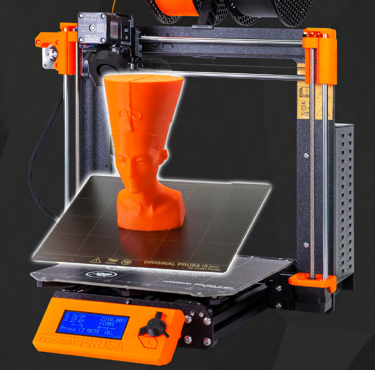
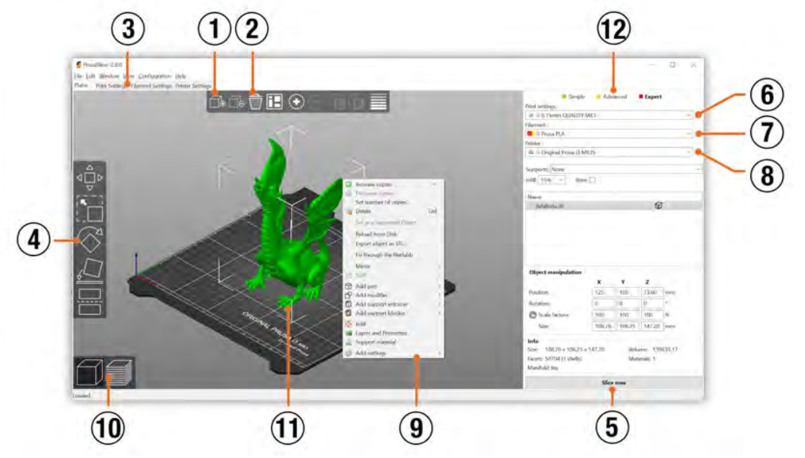
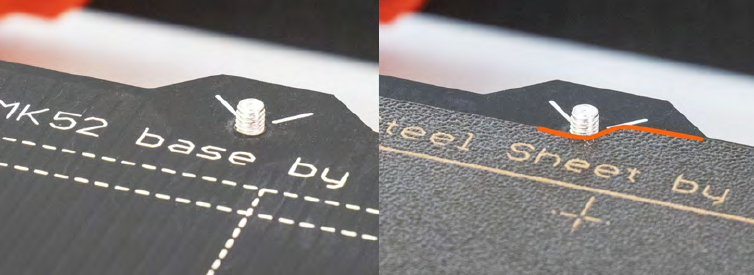
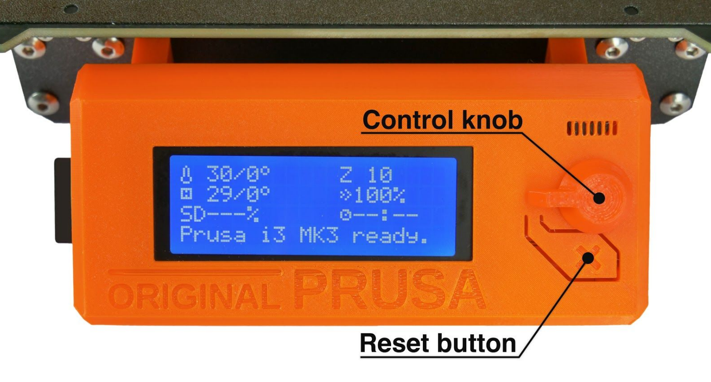
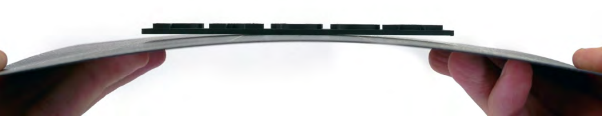

# 3D Printing Induction

## The World of 3D Printing

- Types of 3D printing: FDM (fuse deposition modeling), Laser (SLS, DMLS, EBM), Resin, Ceramic, Food, Metal printing
- Filament material: PLA, PETG, ABS, TPU, Nylon and many others
- Printer brands: Prusa, Creality, Ender, LulzBot, Ultimaker, Bambu
- Ideas of what to print: repair broken plastic parts, custom spacers, prototypes, figurines, functional prints, organisers, print-in-place

The starting point for everyone is PLA on a FDM 3D Printer, you can then upskill into more difficult filaments and more advanced 3D printer types.

You can easily start by printing models from the internet: [Printables, Thangs, Thingsverse - see this wiki page for full list of websites](./links-and-resources.md)

## Basic steps on how to 3D print

- Find a model online, take note of the specifications of that model, download the files (usually in .stl format)
- Load the files into a slicer software, we use [Prusa Slicer](https://www.prusa3d.com/page/prusaslicer_424/), it will looks like this:

- Ensure specifications from your downloaded model are edited into the slicer software
- Slice the model, which will export a .gcode file and load that onto an SD card
- Put the SD card in printer, follow our checklist within the printer area, start the print
- After print ends, clean up printer, pay for filament used (honesty box)
- ... if print the fails, try again or go back to slicer and make changes to your print settings

## Slicer Software

A Slicer is software that creats 'slices' a 3D models into machine code for the 3D printer to follow (.gcode). This is an essential step in preparing your project for printing on any 3D printer machine. You will import a 3d model into the software and select the correct printer, filament material, print settings (layer height) and infill for your print.

Here at ReMADE we use [Prusa Slicer](https://www.prusa3d.com/page/prusaslicer_424/) but you are welcome to use [the slicer software of your preference](https://en.wikipedia.org/wiki/Slicer_(3D_printing)), do bare in mind that some 3D printer brands require you to use their official slicer software (i.e. Bambu).

### Basic steps within Slicer settings:
- Import 3D model: right click the file and select 'open with Prusa Slicer'
- Choose **Print Settings**: (0.2 mm is default, our machines are limited to 0.1 mm)
- Select the correct**Filament**: (PLA/PETG/etc and colour)
- Select the correct **Printer**: [see the 3D printers we have at our space](./3d-printers)
- Choose **Supports** : (no/grid/snug/organic)
- Choose **Infill** : (20% is the default, select any range between 10 - 100%)
- Bottom right of slicer software - click on **Slice now**
- The screen will change, in bottom right area you can find the **amount of filament used** and **estimated build time**
- Now the **Slice now** button has become **Export G-code** - click on that and save the .gcode file to you work folder

### Slicer steps & tips
- Ensure the correct printer and filament are selected (follow the specs)
- Select **Draft quality (0.2 mm)** for your first print, as it prints quicker and less waste
- 20% infill is usually OK for most prints, change only if you are looking for something to be extra solid or if your model is very small
- Take note of amount of material (g) and time estimated for print to finish
- Keep a dedicated folder for all your 3D models, gcode exports, slicer sessions and other files on your system for good version control.
- Rename the gcode files to something short with your name and version on it, the printer LCD screen is very small (e.g. Alice-necklace-v1.gcode)
- Move .gcode file to your personal SD card, or bring the file to the makerspace on a USB stick 
- Save your slicer session before closing (this is important for when you will make a v2)

# Risks
- burning of fingers during operation and filament changing - the 3D printer extruder will reach over 200°C so do not touch it.
- crushing hazard during operation - do not place fingers in gears or axis of the printer.
- inhalation of VOCs – do not put your face into the print, selection of filament and using only FDM makes our current setup safe
- fire – the hairspray is flammable and there is slight risk of short circuiting of power-supply of printer (electrical fire) if you spray it whilst the machine is on. Always apply hairspray to the printer sheet when it has been taken off the printer bed.

# Safety
Recommended PPE: light gloves

**Emergency stop: the X button below the LCD screen will halt the machine at any time.**

In case of fire: unplug the machine first at the wall socket then apply fire-extinguisher to the machine.

# Errors & Troubleshooting

## Normal types of 3D printing errors:
- Birds nest (filament non-adhesion)​: (add link to some video / guide)
- The print detaches from the build plate (add link to some video / guide)​ 
- Blocked nozzle or excess material on nozzle (add link to some video / guide)

Report all other printer problems or error messages from the printers in the Telegram channel.

If you don’t report the printer is broken, we won’t know it needs fixing

# Checklist for 3D Printing - Prusa MK3s

## Prepare to print

- Use two hands and remove the flexible metal print sheet
- De-dust the whole print sheet with soft fabric 
- Use hairspray on the area where your print will be (see: slicer software)
- Re-align the print sheet as shown

- Turn on the 3D printer (switch is located on the back of machine)
- Use the LCD control menu:

-- Press the Control Knob like a button
-- Rotate the knob and select ‘Load filament’ 
-- Place filament into the hole on top of print head
-- Run the colour check during filament loading process TWICE
- Clean nozzle with plastic tool found next to printers

## Start the print
- Insert SD card on left side of LCD screen (metal part facing you)
- The LCD screen will update, press the Control Knob like a button
- Navigate to ‘Print from SD’, scroll by turning the Control Knob
- Select the correct .gcode file you have prepared (tip: rename your files)
- Select the file by pushing the button to start the print
- LCD screen will return to info screen and extruder will start heating up
- When your target temperatures are attained the printer will start
- Monitor closely the first layers of your print (where most prints fail)
- Plan to be present when print ends (see: bottom right of info screen)
- For long prints, do check on it every hour
- Whilst in print mode the menu on the LCD screen changes, if you push the Control Knob then you are able to ‘tune’ the print settings ‘on-the-fly’ 
- Within the menu you can use the **pause print** 
- within the meun is also the **stop print** option

**EMERGENCY STOP: the X button below the LCD screen - just press it once,holding down the X button resets the printer settings**

## End of print

- Wait for the print head to move to 'home' position on the bed
- The print bed will then move forwards towards you
- Pull the print bed sheet off the printer, there are two points marked with ‘fingerprints’ on the sheet for this purpose. (CAUTION: HOT)
- GENTLY flex the print sheet with two hands, this will loosen the print and allows you to push it off without applying much force. The print will not always 'pop' off all times, do not expect this.

- NEVER use metal tools to scrap the print off the print bed sheet, there are plastic tools located near the printers for this purpose.
- If there are traces of the first layer on the print sheet, use the hairspray and the plastic scraper to clean these off.
- Use the Control Knob, select ‘unload filament’, follow instructions on LCD screen and pull the filament out of the print head. 
- If you brought your own: Take SD Card and filament spool
- If not, pay for the grams of material you used with honesty box

# See also
[list of the 3D printers in our makerspace](./3d-printers/)
[Operating manuals for these 3D printers](./manuals/)
[Page of links and resources relating to 3D printing](./links-and-resources.md)

**Source of images used:** Prusa - 3D Printing Handbook - [link to full manual](./manuals/prusa3d_manual_mk3s_en.pdf)
