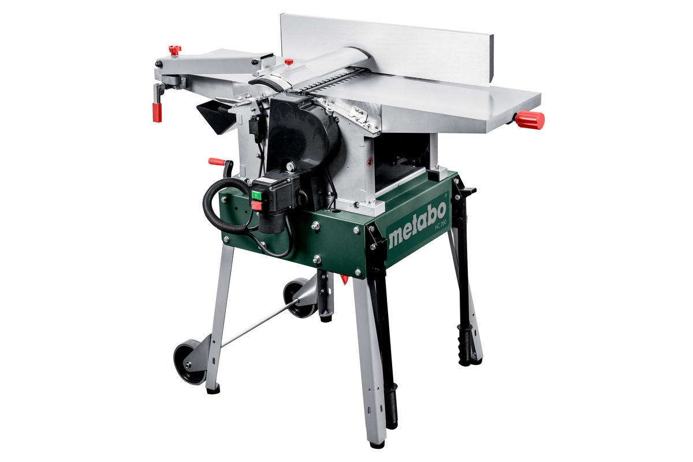

# Planer - thicknesser

This tool is dual function:
- planer: makes a wood board flat
- thicknesser: trims boards to the desired thickness

!!! danger
    - Make sure there are no nails or other metal in the wood
    - Do **not** push the board through forcefully. Let the tool do the work
    - Do not bring your hand close to the drum, always use a pusher block/tool

Brand and model: Metabo HC 260

<https://www.metabo.com/com/en/tools/semi-stationary-tools/bench-thicknesser-planer-thicknessers/hc-260-c-2-2-wnb-0114026000-planer-thicknesser.html>

## Maintenance
[Link to manual](/docs/tools-and-equipment/manuals/planer-thicknesser-metabo-hc-260.pdf)

Some maintenance resources:
- <https://www.youtube.com/watch?v=PZgqrxvpsro>
- <https://www.youtube.com/watch?v=lQ9nhjf9Eig>

## Data sheet

| Characteristic                | Value                     | Value in freedom units  |
-----------------------         | -----------------------   | -----------------------
Dimensions                      | 1110 x 620 x 980 mm       | 3.7 x 2.1 x 3.2 ft
Dressing plates                 | L x W 1040 x 280 mm       | 3.4 x 0.9 "
Chip removal, planing           | 0 - 3 mm                  | 0 - 1/8 "
Chip removal bench thicknesser  | 0 - 3 mm                  | 0 - 1/8 "
Material dressing plates        | Cast aluminium
Material thickness table        | Grey cast iron
Thickness table                 |  L x W 400 x 260 mm       | 15 3/4 x 10 1/4 "
Passage height/width            | 160 / 260 mm              | 6 5/16 / 10 1/4 "
Feed rate                       | 5 m/min                   | 16 ft/min
Diameter of blade shaft         | 63 mm                     | 2 1/2 "
Number of blades                | 2
Revolutions of blade shaft      | 6500 rpm
Mains voltage                   | 220 - 240 V
Rated input power               | 2200 W
Output power                    | 1600 W
Weight                          | 71 kg                     |  157 lbs